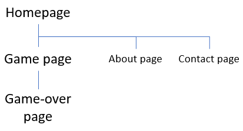

## Introduction
This is the second milestone project of the fullstack software development course of Code Institute. I selected the memory card game assignment: flip cards and find the matching pairs. My take on this game is to create a game with matching pairs that are not identical, but related...

Also, there are two game modes: a mode where you play at your leisure. You can select the number of cards per game. And a challenge mode: you start with 4 cards and need to go through 3 levels. Every level adds 4 cards.

## UX
Although this project is a default/standard project, I decided to use the method of Jesse Garrett: the five planes of UX.

Since this game depends heavily on the interpretation of images, I decided to warn users that rely on assistive technology (e.g. screen readers). An ```aria-label``` attribute is added explaining that this game is not suitable for use with assistive technology. Also, I warn them that there are no image alt tags specified for the game images.

### Strategy Plane
The strategy plane defines the product objectives (goals of the developer and/or organization) and the user needs (goals that come from outside).

#### Product objectives
There is one clear goal for me to create this product: show my skills and qualifications in order to pass the second milestone project.
I added one more objective to this: I want to get a score of at least 80% in order to receive 'first grade honors' at the end of the complete course.

#### User needs
Difficult to determine the user needs. There is clearly no real problem that is solved by this game. The number one user need is: kill some time in a fun way. 

### Scope Plane
Basic features for a memory card game are:
- cards that form a match.
- clickable cards that turn and show the other side.
- a counter to show how many moves you made.

Advanced features for a high grade are:
- multiple game modes.
- keep track of highscores.
- add a twist to the matches you need to find.

Full details on features: [Features](#features).

### Structure Plane
The structure of the site is very simple: homepage connects to the game page, about page and contact page.
The game page has one child: the game-over page.



### Skeleton Plane
This project is designed with the mobile user in mind: mobile first and desktop second. The mobile viewport is the baseline. Media queries are used to handle the desktop viewport.

The wireframes are found [here](https://github.com/ChiefChingu/milestone-two-memory-card-game/blob/master/wireframes.pdf). 

### Surface Plane
The final product can be viewed [here](https://chiefchingu.github.io/milestone-two-memory-card-game/).

#### Typography
Google Font Lato. Easy on the eyes, but not too playful.

#### Color palette
Background color is white: easy on the eye, provides a clean and clear background.

Contrasting colors:
- Purple for headers (#7d51a1).
- Blue for the cards (#2a97ce).
- Orange for CTAs (#ff8d1a).
- Pink for secondary contrast (#e166c4).

The contrasting colors are checked in a [color blind web page filter](https://www.toptal.com/designers/colorfilter) with good results on all filters.

### User Stories
As a user I want to:

1. See an inviting game that makes me curious and want to play!
2. Choose how to play.
3. Be able to play at my leisure.
4. Be able to play 'competitive' and beat my own scores.
5. Click any card as first card and card should turn.
6. Get extra help about what matches to look for.
7. Click any card as second card and card should turn.
8. See if there is a match when two cards are turned.
9. See cards flip back when there is no match.
10. See the number of turns I made so far.
11. In challenge mode: see my best score.
12. Get confirmation when the game is finished.
13. Reset best score to start fresh.
14. Get more information about the cards that are used.
15. Contact the maker of the game in case I have questions, suggestions or compliments.
16. Have fun!

## Features
### Existing features
#### Home
- Explanatory image: explain what a user can expect by showing an example image.
- Call to action: stimulate the user to take action. In this case start the game.
- Navigation on desktop: links to Game, About and Contact.
- Navigation on mobile: hamburger menu leads to modal with link to Game and About.
- On mobile: the modal contains a contact form.

#### Game page
- Game modes: two types of games.
- Game mode 1: chill mode, opens a window with difficulty setting.
- Game mode 2: challenge mode, starts the game directly.
- Game tiles: clickable, turn on click.
- Card context: pairs do not have identical images, so a context is provided in a text label that appears after 1 second.
- Game logic: in case there is a match, the cards animate and remain visible.
- Moves counter: after each move (two cards turned) the counter updates.
- Best score: if challenge mode and if played through once, it shows your best score.
- Navigation on desktop: links to Game, About and Contact.
- Navigation on mobile: hamburger menu leads to modal with link to Game and About.
- On mobile: the modal contains a contact form.

#### Game over page - chill mode
- Congratulations header.
- Explanation of images: where to find the originals.
- Call to action: stimulate the user to take action. In this case restart the game.
- Navigation on desktop: links to Game, About and Contact.
- Navigation on mobile: hamburger menu leads to modal with link to Game and About.
- On mobile: the modal contains a contact form.

#### Game over page - challenge mode
- Congratulations header.
- Best score, if available.
- Last score.
- Evaluation messages: depending on performance.
- Call to action: stimulate the user to take action. In this case to try again and beat your best score.
- Reset highscore: if you want to reset your best to 0.
- Navigation on desktop: links to Game, About and Contact.
- Navigation on mobile: hamburger menu leads to modal with link to Game and About.
- On mobile: the modal contains a contact form.

#### About page
- Explanation of website.
- Link to source of images.
- Navigation on desktop: links to Game, About and Contact.
- Navigation on mobile: hamburger menu leads to modal with link to Game and About.
- On mobile: the modal contains a contact form.

#### Contact page
- Only on desktop: contact form.
- Navigation on desktop: links to Game, About and Contact.

### Features left to implement
- High score board: show all time statistics of all users.
- Timed mode: add a timer as extra challenge. Not included here, because I think it distracts from understanding the context and having a laugh. 
- Randomize images after selection of game mode. Currently, there is a set of 8 pairs. This could be a larger pool of pairs, so you get new images everytime you play again.
- Randomize game over evaluation messages. Currently, there is one message for each scenario. This could be more messages per scenario.
- Animations for Safari users. Currently, animations are disabled for Safari users: there is a bug which I cannot fix. Probably need a Macbook to be able to check the Safari browser console.

## Technologies Used
### Languages
- HTML
    - to create the elements
    - [https://whatwg.org](https://whatwg.org)
- CSS
    - to style the html elements
    - [https://www.w3.org/Style/CSS/](https://www.w3.org/Style/CSS/)
- JavaScript
    - to provide interactivity and logic
    - [https://developer.mozilla.org/en-US/docs/Web/JavaScript](https://developer.mozilla.org/en-US/docs/Web/JavaScript)

### Libraries
- JQuery
    - only for the shuffle cards function (see [Credits](#credits))
    - [https://jquery.com](https://jquery.com)
- Google Fonts
    - to use Lato fonts
    - [https://fonts.google.com/specimen/Lato](https://fonts.google.com/specimen/Lato)
- Font Awesome
    - to use icons
    - [https://fontawesome.com](https://fontawesome.com)
- EmailJS
    - to send contact form
    - [https://www.emailjs.com](https://www.emailjs.com)

### Other tools
- Color blind filter
    - to check the used color palette
    - [https://www.toptal.com/designers/colorfilter](https://www.toptal.com/designers/colorfilter)
- Sqoosh
    - to compress images for faster loading on mobile and desktop
    - [https://squoosh.app](https://squoosh.app)
- GT Metrix
    - to check the loading times
    - [https://gtmetrix.com](https://gtmetrix.com)
- JSHint
    - to check JavaScript
    - [https://jshint.com](https://jshint.com)
- Markup Validation Service
    - to check HTML
    - [https://validator.w3.org](https://validator.w3.org)
- CSS Validation Service
    - to check CSS
    - [https://jigsaw.w3.org/css-validator/](https://jigsaw.w3.org/css-validator/)
- Autoprefixer CSS online
    - to add vendor prefixes
    - [https://autoprefixer.github.io](https://autoprefixer.github.io)

## Testing
All standard online tests passed without any major problems.

The online and manual tests are detailed in the [TEST.md](https://github.com/ChiefChingu/milestone-two-memory-card-game/blob/master/TEST.md).

## Deployment
### GitHub Pages
To publish the website:

- Open GitHub and go to your site's 'Repositories'.
- Go to 'Settings'.
- Scroll down until you see 'GitHub Pages'.
- Under GitHub pages, click on the dropdown under 'Source' and select the 'Master Branch' option.
- A green box should appear with the following message 'Your site is published at https://chiefchingu.github.io/milestone-two-memory-card-game/'.

For more information and great details about publishing: [GitHub](https://help.github.com/en/github/working-with-github-pages/configuring-a-publishing-source-for-your-github-pages-site).

### Cloning a Repository
To clone the website from within your IDE:

- Go to the main page of the GitHub repository and click on the dropdown menu 'Clone or download'.
- Select 'Clone with HTTPS'.
- Open the command line in your IDE.
- Navigate to the directory where you want to clone the project.
- Type 'git clone' followed by the copied URL: paste it right after 'git clone'.
- Press 'Enter' and the local clone will be created

For more information and details about cloning: [GitHub](https://help.github.com/en/github/creating-cloning-and-archiving-repositories/cloning-a-repository-from-github).

## Credits
### Content
All copy is own content.

### Media
All media comes from James Fridman. Do visit his [site](https://www.jamesfridman.com) and [foundation](https://www.jamesfridmanfoundation.org)!

### Acknowledgements
- For the flip card transform I read this [excellent piece of work](https://3dtransforms.desandro.com/card-flip).
- For the three buttons in the Chill mode modal I used the functionality from [https://javascript.info/event-delegation](https://javascript.info/event-delegation).
- The Chill mode modal is based on the modal from [W3Schools](https://www.w3schools.com/howto/howto_css_modals.asp).
- The shuffle card function is based on this snippet at [JSFiddle](https://jsfiddle.net/C6LPY/2/).
- To detect Safari browsers I made use of this [article](https://www.geeksforgeeks.org/how-to-detect-the-user-browser-safari-chrome-ie-firefox-and-opera-using-javascript/).
- The mobile menu is an adaptation of the menu I learned in this course by[Brad Schiff](https://www.udemy.com/course/git-a-web-developer-job-mastering-the-modern-workflow/).

## Special note on JavaScript
JS note: acknowledge the fact that JS code could be far more efficiently written. Make it modular, classes, no global variables, etc. At this stage, this is something I'd like to do, but cannot.
